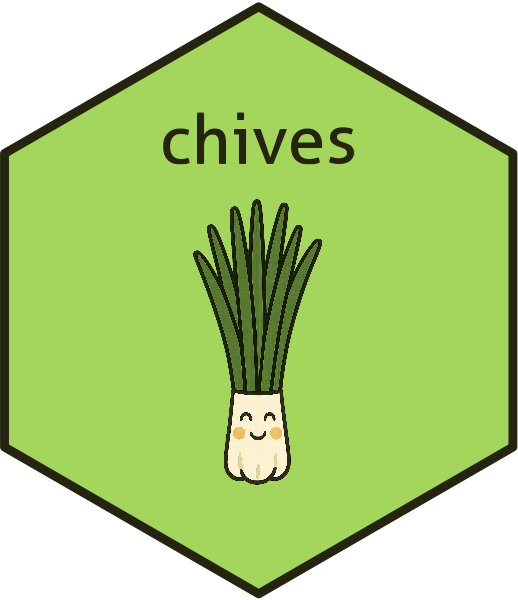

<!-- README.md is generated from README.Rmd. Please edit that file -->

```{r, include = FALSE}
knitr::opts_chunk$set(
  collapse = TRUE,
  comment = "#>",
  fig.path = "man/figures/README-",
  out.width = "100%"
)
```

# chives 

<!-- badges: start -->
[](https://lifecycle.r-lib.org/articles/stages.html#experimental)
[](https://CRAN.R-project.org/package=chives)
<!-- badges: end -->

Chives is an R package containing ggplot chunks pertaining to layers common across
chart types. This simplifies the creation of most basic data visualizations in
survey research.

## Installation

You can install the development version of chives like so:

``` r
library(devtools)
install_github("jjmoncus/chives")

```

## Examples

Coming soon.
